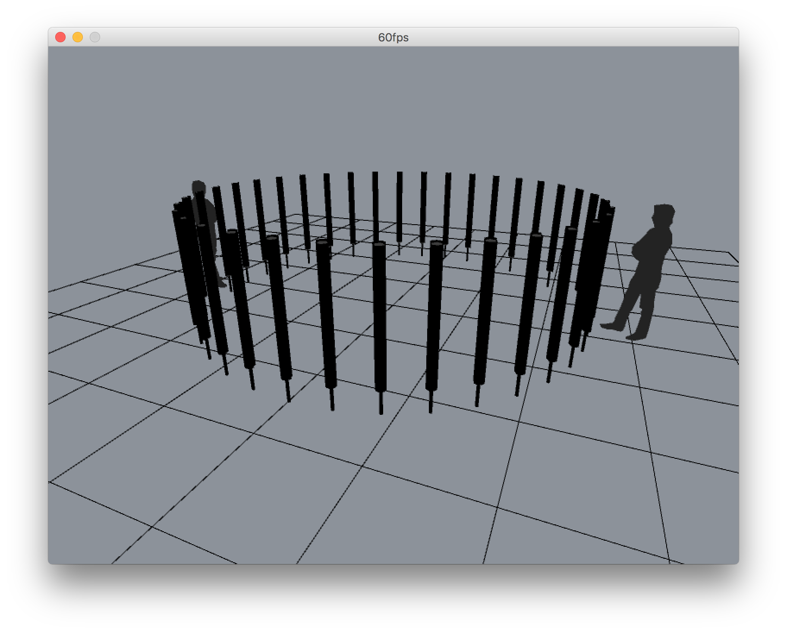

# rythmus-viewer 
**[Rythmus](https://github.com/chevalvert?q=rythmus)** [`hnode`](https://github.com/Hemisphere-Project/STRATUM) 3D previewer

 

## **[Rythmus](https://github.com/chevalvert?q=rythmus)** ecosystem
- [`rythmus`](https://github.com/chevalvert/rythmus) : Rythmus main app
- `rythmus-assistant` : Rythmus mapping and configuration assistant
- [`hemisphere-project/stratum-hnode#rythmus`](https://github.com/Hemisphere-Project/stratum-hnode/tree/rythmus) : leds UDP server & client
- [`rythmus-viewer`](https://github.com/chevalvert/rythmus-viewer) : Rythmus `hnode` 3D previewer
- [`rythmus-sensor`](https://github.com/chevalvert/rythmus-sensor) : Rythmus heart sensor firmware

## Usage

<kbd>d</kbd> : toggle dark mode.  
<kbd>e</kbd> : show/hide environment.  
<kbd>g</kbd> : show/hide floor.  
<kbd>i</kbd> : show/hide info.  
<kbd>r</kbd> : reset.  
<kbd>s</kbd> : start/stop frame recording.  

## Dependencies

- Processing >= 3.3
- [UDP library](https://ubaa.net/shared/processing/udp/)
- [PeasyCam](http://mrfeinberg.com/peasycam/)

## License
[MIT.](https://tldrlegal.com/license/mit-license)
